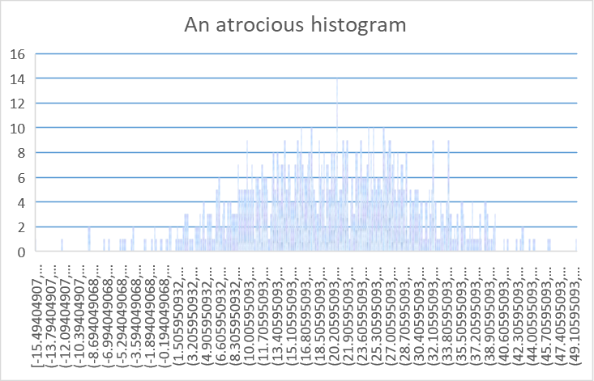

```{r pre-setup, message=FALSE, warning=FALSE, echo=F}
knitr::opts_chunk$set(echo = F, warning = F, message = F)
install.packages(setdiff("pacman", rownames(installed.packages())))
library("pacman")
p_load(tidyr,readr,DiagrammeR,ggplot2,dplyr,lubridate,NHSRplotthedots,readxl,stringr,NHSRdatasets, purrr)

# avoiding tidyverse due to memory issues in RStudio Cloud environment 

```

```{r eval=params$r_only}
subtitle_var <-  "R version"
```
```{r eval=params$xl_only}
subtitle_var <- "Excel version"
```

---
subtitle: `r subtitle_var`
---

# {.tabset}

## Introduction

Welcome to this introductory training session looking at statistics. A reminder of the ground rules for this session:

1. The training is interactive. You’ll be working on code, answering questions, and helping other trainees. Do please ask questions whenever you like, or for extra clarification if anything isn’t as clear as you’d like it to be.

2. Please leave cameras and mics on as much as you reasonably can. Social learning is a vital part of this training, and the more discussion and chat that we get, the better the sessions run.

3. Things will go wrong, people will make mistakes, and code will misbehave. Please be civil and forgiving when these kinds of problems happen. When we're working on problems with code, do be ready to share your screen when you encounter a difficulty. The aim is that we will all collaborate on solving any problems that we might run into. This is the best way of developing a set of strategies for solving problems which is such an important part of the learning journey in any field.


## Data distributions I {.tabset}

### Introduction

Imagine that we are measuring some numeric health or care value in an individual This could be, just for example:

+ height
+ blood pressure
+ number of years since retirement

Without knowing what's generally expected, the number by itself doesn't tell us anything very interesting. We need some context to make sense of an individual number. For values like blood pressure, we often have reference ranges that tell us what a normal blood pressure might be. For other values (like height, or number of years since retirement) we generally have some clear idea of what a normal number might be from our daily experience. 

But how about cases where we have neither of these ways of making sense of a number available to us. What should we do then? 

This training is designed to give an introduction to thinking statistically. Over the course of the training, you'll learn (or, in many cases, revisit) techniques for making sense of numbers. You'll also learn techniques for applying these techniques to real-world data using statistical software.

----

#### Exercise

Can you come up with some suggestions for good ways of making sense of numbers?

----

One way that we could gain this context is by looking at that value in a range of other people. Let's do that now. Imagine that we are measuring a value called `val` in one person (called Susan). We discovered that for Susan, `val` = 7. Without some kind of context for that number, we can't really make sense of what it means. So let's compare Susan's `val` with all the other values of `val` that we can find. Luckily (and unwisely ignoring data protection legislation) we might be able to find hundreds of other values of `val` to compare to Susan's. Put together, and counted in groups, we might end up with a graph that looks like this:

```{r echo=F, fig.height=2, fig.width=4, message=FALSE, warning=FALSE}
# this code here is a little bit too advanced for this course, so hidden for now

uniform_data <- function(n, dof, range, val, name, varname) {
  
  data <- tibble(patient=1:n, val=sample(1:range, n, replace=T))
  
  if (dof > 1) {
    
  for(i in 1:(dof-1)) {
    data <- data %>% mutate(val=(val + sample(1:range, n, replace=T)))  
  }
    data <- data %>% mutate(val=(val / dof))
  }                      
  ggplot(data) +
  geom_bar(aes(val)) +
  geom_vline(xintercept=val, color="#cc0000") +
  annotate("text", x=(val+(0.2)), y=0.5*(max(data %>% count(val))), label=paste0(name, "'s ", varname, " = ", val), angle=90, color="#cc0000") +
    xlab(paste0("Value of ", varname)) +
    ylab(paste0("Count of ", varname))
}

uniform_data(400, 1, 6, 7, "Susan", "val")

```

This suggests that Susan's `val` of 7 is something interesting because it's higher than any of the other comparison values of `val` that we found. What's more interesting (for this training at least) is that in gathering all those other values of `val` we've built a really important statistical tool here (although it might not feel like it!). This graph showing how a value varies in a population is called the **empirical frequency distribution**. We'll explore this in the next section.

### Data handling


```{r eval=params$xl_only, results='asis'}
cat("In Excel, the most useful data-handling tips are:  \n  \n")
cat("+ make your data into tables using (CTRL + T)  \n")
cat("+ checking the formatting carefully, especially for dates  \n")
cat("+ learning how to use absolute and relative references  \n")
cat("+ consider separating the data and the calculations. You can put all the data in one sheet, then all the calculations in another, rather than mixing data and calculations across your workbook  \n")
cat("+ use named variables and the name manager to keep track of which data is where  \n")

```

```{r eval=params$r_only, results='asis'}

cat("Loading data into R is a topic in itself. The relevant chapter of [*R for Data Science*](https://r4ds.had.co.nz/data-import.html) is highly recommended. But some quick tips on good data handling practices:  \n  \n")
cat("+ set up a data directory to hold your data files  \n")
cat("+ strongly consider using Rstudio projects to manage file locations  \n")
cat("+ use `head()` to check the data types that you're loading")
cat("\n \n Some useful functions for loading data include:")
```

```{r eval=params$r_only, results='asis', echo=params$r_only}
# readcsv() for local csv files
read_csv("data/data_intro.csv") %>% head() %>% knitr::kable() 

# read_excel for local excel files
read_excel("data/data_intro.xlsx") %>% head() %>% knitr::kable() # for local Excel files

# openxlsx is useful for opening remote Excel files
openxlsx::read.xlsx("https://www.opendata.nhs.scot/dataset/4ace86c2-2c0f-4620-b544-932148c2c4d3/resource/530cb70a-f747-4b3b-b75a-06353ae78e8d/download/icd10-lookup.xlsx") %>% head() %>% knitr::kable() 

# It's possible to load and process data immediately, without saving any data into the R environment
read_csv("data/data_intro.csv") %>%
  mutate(date = dmy(date)) %>%
  group_by(month(date, label=T)) %>%
  summarise(date = month(date, label=T), total=sum(total)) %>%
  distinct() %>%
  ggplot() +
  geom_col(aes(x=date, y=total))

# But more usually, you'll save data to a variable
data_intro <- read_csv("data/data_intro.csv")
```

```{r eval=params$r_only, results='markup', echo=params$r_only}
# inspect using head()
data_intro %>%
  head()

```


### Empirical frequency distribution

+ empirical = made by measuring
+ frequency = how often some value occurs in those measurements
+ distribution = how those measurements are spread out

The reason the empirical frequency distribution is important is that it gives us a way of understanding how our (Susan's) `val` compares to those in other people. At its most simple, just seeing the graph of how frequencies are distributed tells us a lot about how to understand our one case. For example, image if we'd seen something like this when we looked at Susan's `val` of 7:

```{r echo=F}
uniform_data(4000, 1, 40, 7, "Susan", "val")
```

Would you now feel differently about Susan's `val`? Or this:

```{r echo=F}
uniform_data(4000, 2, 8, 7, "Susan", "val")
```

How about this:

```{r echo=F}
uniform_data(400, 12, 24, 7, "Susan", "val")
```

Or even this:

```{r echo=F}
uniform_data(400, 1, 3, 7, "Susan", "val")
```

So, an interim conclusion: I think we understand Susan's `val` quite differently depending on how `val` is distributed in the population. Perhaps this is labouring the point, but the aim of statistics is to make sense of some value by comparing it to the range of values in some population. That means that the rest of this course will explain how to find and use:

1. Tools to **describe data**, helping us understand how values are distributed in populations
2. Tools to understand how our value of interest (like Susan's `val` in the examples above) relate to that data

## Describing data {.tabset}

### Counting

So far, we haven't done much to try and describe the frequency distributions that we've looked at. Instead, we've really just looked at their graphical representation by plotting them so that we can see where a single value (Susan's, in this case) sits.

Much of the power of statistics comes from more precise ways of describing distributions. In this section, we'll cover some simple tools for doing this kind of **descriptive statistics**. We'll use some data like this:

```{r echo=F, message=F}
# setting up some data that we can then describe

# code explanation - we use rnorm() to generate data that follows the normal distribution. We specify the number of observations (1000), the mean (20), and the standard deviation (10). That generated data is then converted into a one-column tibble, and assigned to the variable name descriptive_data so that we can use it later on.

descriptive_data <- tibble(a=rnorm(1000, 20, 10))

# code explanation - we take our descriptive data, and use ggplot() to draw a histogram by specifying geom_histogram(). The rest of this code then does some labelling (using xlab and ylab), then stores the resulting graph in the variable name descriptive_data_plot

descriptive_data_plot <- descriptive_data %>%
  ggplot() +
  geom_histogram(aes(a), fill="grey", color="black") +
  xlab("Value of var") +
  ylab("Count of var")

# we can print the graph by just calling its name
descriptive_data_plot

```

If you're not used to looking at graphs like this, we'll pause here for a bit of explanation. First of all, we're looking at the way that some measure (called `var`) changes. Effectively, we take all the measures of `var`, group them (so group together all the `vars` of 1, then 2, then...), and then count how many are in each group. It's this count that gives the height of the bars in the graph. Note that we'll get different bars if we choose to group the `vars` differently. So instead of counting in 1s (as above) we could count in 5s:


```{r echo=F}
descriptive_data %>%
  ggplot() +
  geom_histogram(aes(a), fill="grey", color="black", binwidth=5) +
  xlab("Value of var") +
  ylab("Count of var")
```

Both of these graphs are histograms. The recipe for building a histogram is quite simple, and we'll introduce it in the subsection after next. Before we get to that point though we need to introduce two useful building blocks of descriptive statistics that we'll need to understand before we can properly do that work.

The first of these descriptive statistics that we'll introduce will be very familiar: how many observations do we have here in total? The data that we're working on looks like this:

```{r echo=F}
# Our data is called descriptive_data
# use head() to look at first few rows of data.
head(descriptive_data) %>%
  knitr::kable()
```

We're just looking at the first few rows of our data here. But how many rows of data do we have in total?

```{r echo=F, eval=params$xl_only, results='asis'}

cat("Assuming that we have our data in a table named Table1, our Excel formula would be:  \n  \n")
cat("`=COUNT(Table1)`")

```


```{r eval=params$r_only, echo=params$r_only}
# our data has one row per observation, so we can use nrow() to count rows.
nrow(descriptive_data)

# length() is a false friend here, as it counts the length of vectors, rather than tibbles
length(descriptive_data) # =1
```

### Range

Our next descriptive statistics building block is the range. 

```{r echo=F}
## code explanation. We take our existing descriptive_data_plot, and add two new layers to label the range. geom_segment does the line itself, and we get the end positions via the min() and max() functions. geom_label does the label, again with positions from the descriptive_data.

descriptive_data_plot +
  geom_segment(aes(x=min(descriptive_data), xend=max(descriptive_data), y=80, yend=80), arrow=arrow(ends="both", type = "closed")) +
  geom_label(aes(label="Range", x=(min(descriptive_data) + max(descriptive_data))/2, y=80), size=5)
```

**Range:** what's the gap between the highest and lowest values in our data?

We can calculate the range as follows:
```{r eval=params$r_only, echo=params$r_only}
# range shows the minimum and maximum values
range(descriptive_data)

# you can also calculate the component values of range using min() and max()
max(descriptive_data) - min(descriptive_data)

# or using subsetting
range(descriptive_data)[1] # gives the min, while range(descriptive_data)[2] gives max
```

```{r echo=F, eval=params$xl_only, results='asis'}

cat("Again, with our data in Table1, we can calculate the minimum and maximum values as follows:  \n  \n")
cat("`=MIN(Table1)`  \n")
cat("`=MAX(Table1)`  \n  \n")
cat("We can then calculate the range from these minimum and maximum values:  \n  \n")
cat("`=MAX(Table1) - MIN(Table1)`  \n  \n")
```

### Quartiles

This section should really be called quartiles, quantiles, and other *tiles - it's all the same concept, as we'll see.

Range looks at our data as a whole. Knowing the highest and lowest values is important. But finding out the ranges of different parts of our data is even more useful. For example, we might want to know about, say, the tallest 25% of patients in a group, as they might have different health outcomes than others.

Let's look at the same data again, but this time we'll split the data into four groups. Each of these groups will have the same number of members. We'll call these groups **quartiles** (quartus is latin for four), and label them from the 1st to the 4th:

```{r fig.height=5, fig.width=7, echo=F, message=F}

quarts <- quantile(descriptive_data$a, probs = seq(0, 1, 0.25))
descriptive_data_plot +
  geom_segment(aes(x=quarts[1], xend=quarts[2], y=60, yend=60), arrow=arrow(ends="both", type = "closed")) +
  geom_label(aes(label="1st quartile", x=(quarts[1] + quarts[2])/2, y=60), size=5) +
  
  geom_segment(aes(x=quarts[2], xend=quarts[3], y=110, yend=110), arrow=arrow(ends="both", type = "closed")) +
  geom_label(aes(label="2nd quartile", x=(quarts[2] + quarts[3])/2, y=120), size=5) +
  
  geom_segment(aes(x=quarts[3], xend=quarts[4], y=90, yend=90), arrow=arrow(ends="both", type = "closed")) +
  geom_label(aes(label="3rd quartile", x=(quarts[3] + quarts[4])/2, y=100), size=5) +
  
  geom_segment(aes(x=quarts[4], xend=quarts[5], y=60, yend=60), arrow=arrow(ends="both", type = "closed")) +
  geom_label(aes(label="4th quartile", x=(quarts[4] + quarts[5])/2, y=60), size=5)

```

Looking back at the data, we can see that each quartile contains the same number of individuals:

```{r echo=F, results='asis'}
# code explanation - create a new column called Quantile range by using the cut() function to split the values into quartiles inside mutate. Then group by these new quartile labels, and count.

descriptive_data %>%
  mutate(`Quantile range`=cut(a, quantile(a), include.lowest=T)) %>%
  group_by(`Quantile range`) %>%
  count() %>%
  knitr::kable()

```

What's interesting here is that we can see that the range that each quartile covers differs enormously:

```{r echo=F, results='asis'}
tibble(range = quantile(descriptive_data$a)) %>%
  mutate(Quantile = paste0(round(lag(range), 2), " to ", round(range, 2))) %>%
  mutate(Width = range - lag(range)) %>%
  select(!range) %>%
  filter(!is.na(Width)) %>%
  knitr::kable()


# we can also do this in the tidyverse way if we want to count by groups elegantly:
# NOT SURE THIS CODE FITS WELL HERE
descriptive_data %>%
  count("Rounded value of a" = round(a, -1)) %>%
  knitr::kable(align="lr")

```

This means that knowing about the ranges of each of the quartiles gives us a measure of the spread of the data. There's no particular reason to split the data into four parts either. We can generate quintiles (five), hexiles (six), deciles (ten), centiles (hundred) or whatever other dissection of the data we like. So the point about looking at widths goes much wider that just quartiles, but is instead a general feature of frequency distributions. The reasons that measuring how the data is spread is a vital part of understanding distribution is that different spreads can cause us to interpret individual results differently. Think about the following graphs, each showing the same individual result (the red lines in the graphs) on different distributions:

```{r echo=F}

uniform_data(400, 1, 6, 5, "Susan", "val")

```

and

```{r echo=F}

uniform_data(400, 5, 6, 5, "Susan", "val")

```

and

```{r echo=F}

uniform_data(400, 36, 6, 5, "Susan", "val")

```

Each of these graphs have the same number of observations, and the same average. What's different here is the spread of the values. We'll explore the implications of spread more fully in a later section.

To calculate quartiles:

```{r echo=F, eval=params$xl_only, results='asis'}

cat("Again, with our data in Table1, we can calculate quartiles as follows:  \n  \n")

cat("Lower bound of first quartile: `=QUARTILE.INC(Table1, 0)`  \n")
cat("Upper bound of first quartile: `=QUARTILE.INC(Table1, 1)`  \n")
cat("Upper bound of second quartile: `=QUARTILE.INC(Table1, 2)`  \n")
cat("Upper bound of third quartile: `=QUARTILE.INC(Table1, 3)`  \n")
cat("Upper bound of fourth quartile: `=QUARTILE.INC(Table1, 4)`  \n")

cat("  \n  \nTo calculate percentiles, we use `=PERCENTILE.EXC`:  \n")
cat("Upper bound of first centile: `=PERCENTILE.EXC(Table1, 0.01)`  \n")
cat("Upper bound of 90th centile: `=PERCENTILE.EXC(Table1, 0.9)`  \n")
  
cat("  \n  \nTo calculate which percentile a value would be located in, we use `=PERCENRANK.EXC`:  \n")
cat("Percentile rank of the value in C16: `=PERCENTRANK.EXC(Table1, C16)`  \n")

```

```{r echo=params$r_only, eval=params$r_only, results='markup'}
# use the quantile() function to obtain the quantiles for your data, which gives you a quartile by default
quantile(data_intro$total)

# use indexing to access individual values
quantile(data_intro$total)[5] - quantile(data_intro$total)[1]

# get different quantiles using probs
quantile(data_intro$total, probs = seq(0, 1, 0.2)) # e.g. for quintiles
quantile(data_intro$total, probs = seq(0, 1, 0.1)) # e.g. for deciles

# use cut() to divide a value into quantile groups 
data_intro %>%
  mutate(quantile = cut(total, breaks=quantile(data_intro$total))) %>%
  head()

```
### Histograms
So we've looked at how to count values, and how to understand ranges. We'll now combine elements of both of these to produce a really useful visualisation for our data: the histogram. To make a histogram:

+ figure out the range of values
+ divide that range into a suitable number of different bins (groups)
+ count the number of observations in each bin
+ plot the number of observations per bin 

```{r eval=T, echo=params$r_only}
descriptive_data %>% # take our data, and pipe it to
  ggplot() + # ggplot, which is the main graphing function that we'll use
  geom_histogram(aes(a), fill="grey", color="black", binwidth=5) + # plot histogram of column a with a binwidth of 5
  xlab("Value of var") + # add labels
  ylab("Count of var")
```

Here, we've set the width of each bin to 5. Unlike the quartiles we were looking at earlier, each group (bin) is the same width. That means that we get a good idea of the distribution of our data. In this case, we see that the bins towards the middle of our range (and that's about `r round(median(descriptive_data$a) ,1)` here) are taller - and so contain more individuals - than the bins at the edge of our range. That idea of finding the middle of a range of data is our next building block. We'll go on now to think about averages in more detail. But as a final thought in this introduction to histograms, we can specify the bins in any way that we like, and selecting the most helpful arrangement of bins is an important part of making sense of your data:

```{r eval=params$r_only, echo=params$r_only}
# similarly, but specifying number rather than width of bins, and playing with themes
descriptive_data %>%
  ggplot() +
  geom_histogram(aes(a), fill="lightblue", color="red", bins=18) +
  theme_linedraw() +
  xlab("Value") +
  ylab("Count")
```

#### Exercise

I've ruined my morning by spending it trying to make the most unappealing and useless histogram possible. Can you fix it for me?

```{r eval=params$r_only, echo=params$r_only}
# tweak this unhelpful histogram
descriptive_data %>%
  ggplot() +
  geom_histogram(aes(a), fill="black", color="green", bins=400) +
  theme_minimal() +
  xlab("A pointless label") + # add labels
  ylab("Another pointless label") +
  ggtitle("An atrocious histogram")
```

```{r eval=params$xl_only, echo=params$xl_only}

```

### Averages{.tabset}

Let's go back and look at Susan's var again. In this graph, we can see that Susan's var is higher than most of the values of var that we've collected:

```{r echo=F, message=F}
uniform_data(400, 5, 6, 5, "Susan", "val")
```

Interesting and decorative though graph like these are, it would be very useful if we could give a quick indication of what we might expect a typical value of `var` to be without going through all the trouble of plotting a graph. This is the reason that averages are useful - they give us a quick way of saying what we'd expect a typical value to be. Statisticians also refer to this as the **central tendency** of the data - where the middle is located.

In this section, we'll cover three ways of giving this average. As we'll explain, each have strengths and weaknesses - and that learning to interpret and use them correctly is the key job here.

#### Mean
**Mean:** count up all the values, add them together, and divide by the total number of values

```{r echo=F, message=F}
# explanation. The code that draws these graphs and plots the appropriate average is a bit beyond the level of this course. Roughly, though, we set up a custom function called data_ave_graph that allows us to specify three things:
## - some data - those are the n, shape1 and shape2 arguments 
## - a named value (val, varname, and name)
## - and the kind of average (avname)

#The function then generates some data for us, and plots it. We then overlay the named value as a single line on the histogram, and writes a descriptive title
# That's complicated, but worth doing because we can then generate as many of these graphs as we like with a single line of code (see below)

data_ave_graph <- function(n, shape1, shape2, val, varname, name, avname) {
  
data <- tibble(var = 6*rbeta(n, shape1, shape2))

print(data %>%
  ggplot() +
  geom_histogram(aes(var), binwidth=0.25) +
  geom_vline(xintercept=val, color="#cc0000") +
  annotate("text", x=(val+(0.2)), y=(n/20), label=paste0(name, "'s ", varname, " = ", val), angle=90, color="#cc0000") +
  geom_vline(xintercept=round(avname(data$var), 2), color="#0000cc") +
  annotate("text", x=(round(avname(data$var), 2)+(0.2)), y=(n/20), label=paste0(deparse(substitute(avname)), " = ", round(avname(data$var), 2)), angle=90, color="#0000cc") +
    xlab(paste0("Value of ", varname)) +
    ylab(paste0("Count of ", varname)) +
    ggtitle(paste0("Histogram of ", n, " observations of ", varname ," with a ", deparse(substitute(avname)), " of ", round(avname(data$var), 2))))

}

# this is all we need to write to generate each graph
data_ave_graph(1000, 5, 5, 5, "var", "Susan", mean)

```

To calculate a mean:

```{r eval=params$r_only, echo=params$r_only}
#mean() is the usual function, and it's good practice to set the na.rm option - otherwise your code will produce an error if you have missing data
mean(descriptive_data$a, na.rm=T)

# round() is often useful with mean()
round(mean(descriptive_data$a, na.rm=T),2)

# you might also use the trim option if your data has outliers
outliers_data <- c(descriptive_data$a, 100000, 60000000)
mean(outliers_data)
mean(outliers_data, na.rm=T, trim=0.05)

#idiomatic tidyverse version
descriptive_data %>%
  pull(a) %>%
  mean(., na.rm=T) %>%
  round(.,2)
```

```{r echo=F, eval=params$xl_only, results='asis'}

cat("With our data in Table1, we can calculate averages as follows:  \n  \n")

cat("Mean of Table1: `=AVERAGE(Table1)`  \n")
cat("Trimmed mean, omitting the extreme 5% of the range: `=TRIMMEAN(Table1, 0.05)`  \n")
cat("Rounded mean to 2 decimal places: `=ROUND(AVERAGE(Table1), 2)`  \n")

```


#### Median
**Median:** find the middle value of the range

```{r echo=F}
data_ave_graph(1000, 5, 5, 5, "var", "Susan", median)
```

To calculate a median:

```{r eval=params$r_only, echo=params$r_only}
#median() is the usual function, and it works as mean()
median(descriptive_data$a, na.rm=T)

# round() again
round(median(descriptive_data$a, na.rm=T),2)

#idiomatic tidyverse version
descriptive_data %>%
  pull(a) %>%
  median(., na.rm=T) %>%
  round(.,2)
```

```{r echo=F, eval=params$xl_only, results='asis'}

cat("Again, with our data in Table1, we can calculate medians as follows:  \n  \n")

cat("Median of Table1: `=MEDIAN(Table1)`  \n")

```

#### Mode
**Mode:** find the most common value in the data

```{r}
# no built-in mode, so writing our own function
mode <- function(data) {
  tibble(var = data) %>%
    mutate(rounded_var = round(var, 2)) %>%
    count(rounded_var) %>%
    filter(n == max(n)) %>% 
    pull(rounded_var) %>%
    mean()
}

data_ave_graph(1000, 5, 5, 5, "var", "Susan", mode)
```

To calculate a mode:

```{r eval=params$r_only, echo=params$r_only}
# there's no built-in mode in R, but lots of good ways to calculate one.
descriptive_data %>%
  mutate(rounded_a = round(a, 2)) %>%
  count(rounded_a) %>%
  filter(n == max(n)) %>% 
  pull(rounded_a) %>%
  mean()
```

```{r echo=F, eval=params$xl_only, results='asis'}

cat("Again, with our data in Table1, we can calculate the mode as follows:  \n  \n")

cat("Mode of Table1: `=MODE(ROUND(Table1, 2))`  \n")

```

#### Comparison
For this data, all three averages are very likely to be close together, if not identical. It's possible that they might not be - the data is generated randomly each time the graph is drawn - but the chances are that they will be very close together. 

So why use several different ways of measuring the average? Let's have a look at how the three averages change when our data is *skewed* - that is, where the most common value isn't found at or near the middle of the range. The way that statisticians talk about skewness can be a source of confusion, so let's include a simple histogram demonstrating the terminology we need to talk about skew:

```{r cache=T}
tibble(var1 = 6*rbeta(10000, 1, 5), var2 = 6*rbeta(10000, 15, 15), var3 = 6*rbeta(10000, 5, 1)) %>%
  ggplot() +
  geom_histogram(aes(x=var1), bins=50, fill="white", color="blue") +
  geom_histogram(aes(x=var2), bins=50, fill="white", color="grey") +
  geom_histogram(aes(x=var3), bins=50, fill="white", color="red") +
 # geom_text(aes(x=1, y=1000), label="<- Negative skew", color="blue") +
  annotate("text", x = 1, y = 1000, label = sprintf('\u2190 negative skew'), color="blue") +
  annotate("text", x = 5, y = 1000, label = sprintf('positive skew \u2192'), color="red") +
  theme_void()
```

Now let's take some negatively-skewed data, and compare our three methods for finding an average:

```{r echo=T}
data_ave_graph(1000, 1, 5, 5, "var", "Susan", mean)
data_ave_graph(1000, 1, 5, 5, "var", "Susan", median)
data_ave_graph(1000, 1, 5, 5, "var", "Susan", mode)

```

So for negatively-skewed data, the mean tends to be bigger than the median, which tends to be bigger than the mode. It is possible to quantify that difference, or visualise it,  

```{r echo=F, eval=F, cache=T}
# this code will repeatedly calculate mean-median for skewed, and non-skewed data, and plot the results 
x <- ""
y <- ""
for(i in seq_along(1:1000)) {
x[i] <- mean(rbeta(1000, 1, 5)) - median(rbeta(1000, 1, 5))
y[i] <- mean(rbeta(1000, 5, 5)) - median(rbeta(1000, 5, 5))
}

ggplot(tibble(x=as.numeric(x), y=as.numeric(y))) +
  geom_histogram(aes(x=x), fill="#990000") +
  geom_histogram(aes(x=y), fill="#000099") +
  xlab("Difference between mean and median for skewed (red) and non-skewed (blue) data")

```


So being able to describe the average of our data in three different ways is a useful shorthand - assuming that we understand how the skew of our data is likely to affect it. We'll look later at some other reasons that we might want to think more carefully about how we describe the average of our data.

For now, though, let's look at two graphs where the average is the same, but the distributions look very different:

```{r}
tibble(`Distribution 1` = 6*rbeta(1000, 5, 5), `Distribution 2`=6*rbeta(1000, 2,2)) %>% 
  pivot_longer(everything()) %>%
  ggplot() +
  geom_histogram(aes(value, color=name), binwidth=0.25, fill="white") +
  facet_wrap(~name) +
  theme_void() +
  theme(legend.position="none")
```

We'll need an extra tool to describe the way these distributions differ, and we'll introduce it in the next section.

### Standard deviation and friends

Let's add some extra information to our graphs here. Standard deviation is a measure of spread. Diff from range, though, because (as the name suggests), it's standardised - so it won't be affected purely by the largest and smallest values in our data, but instead will give an indication of the general degree of spread found in the data.

We'll need to work through an intermediate stage before we can calculate the standard deviation, though. Let's start with a simpler measure: variance.

Let's look at the first few rows of our data again.

```{r}
descriptive_data %>%
  head() %>%
  knitr::kable()
```

These numbers vary. We can get a sense of how much they vary by calculating their distance from the mean:

```{r}
descriptive_data %>%
  mutate(distance = a / mean(a)) %>%
  head() %>%
  knitr::kable()
```

However, this won't actually be a useful measure of spread. If we total up all the distance values in our set, we'll end up with a very small number (here it's `r round(descriptive_data %>% mutate(distance = a - mean(a)) %>% pull(distance) %>% sum(), 3)`). Because this average measure is based on the average distance from the mean, it has to be approximately equal to 0. This isn't useful to us, so we should square these distances instead:


```{r}
sum_of_squares <- descriptive_data %>% mutate(sq_distance = (a - mean(a))^2) %>% pull(sq_distance) %>% sum()
```

Once we've got this sum of squares, we can then divide it by the number of samples we have (actually n-1 for reasons related to the logic of sampling). That gives us an indication of the variance - how far away from the mean we would expect a number in our sample to be:

```{r}
variance <- sum_of_squares / nrow(descriptive_data)
```

Because that variance comes from squaring all our numbers, it's a bit hard to interpret, so the usual practice is to give the square root of the variance. This is the standard deviation:

```{r}
standard_deviation <- variance ^ 0.5
standard_deviation
```

```{r echo=params$r_only, eval=params$r_only}
cat("Luckily, in R, you don't need to do this manually. There are two useful functions that generate the variance and the standard deviation for you without all this manual work.  \n")

var(descriptive_data$a)
sd(descriptive_data$a)
```


```{r}

descriptive_data %>%
  ggplot() +
  geom_histogram(aes(x=a))
  


```

```{r eval=params$r_only, echo=params$r_only}
sd(descriptive_data$a)

# again, a good combo with round()

round(sd(descriptive_data$a), 2)

```


## Theoretical distributions

The answer to the cumbersome description of data that we've done so far.
  * probability function

```{r eval=F, echo=F}
non_uniform_data <- function(n) {
  ggplot(tibble(Patients=1:n, val=(sample(1:6, n, replace=T) + sample(1:6, n, replace=T) + sample(1:6, n, replace=T)))) +
  geom_col(aes(x=val, y=Patients))
}

non_uniform_data(4000)
```


```{r eval=F, echo=F}
heights <- read_csv("data/NCD_RisC_Lancet_2020_height_child_adolescent_country.csv")

heights %>%
  filter(Country == "Afghanistan") %>%
  ggplot() +
  geom_line(aes(group=`Age group`, y=`Mean height`, x=Year, color=`Age group`)) +
  facet_wrap(~ Sex)
```

